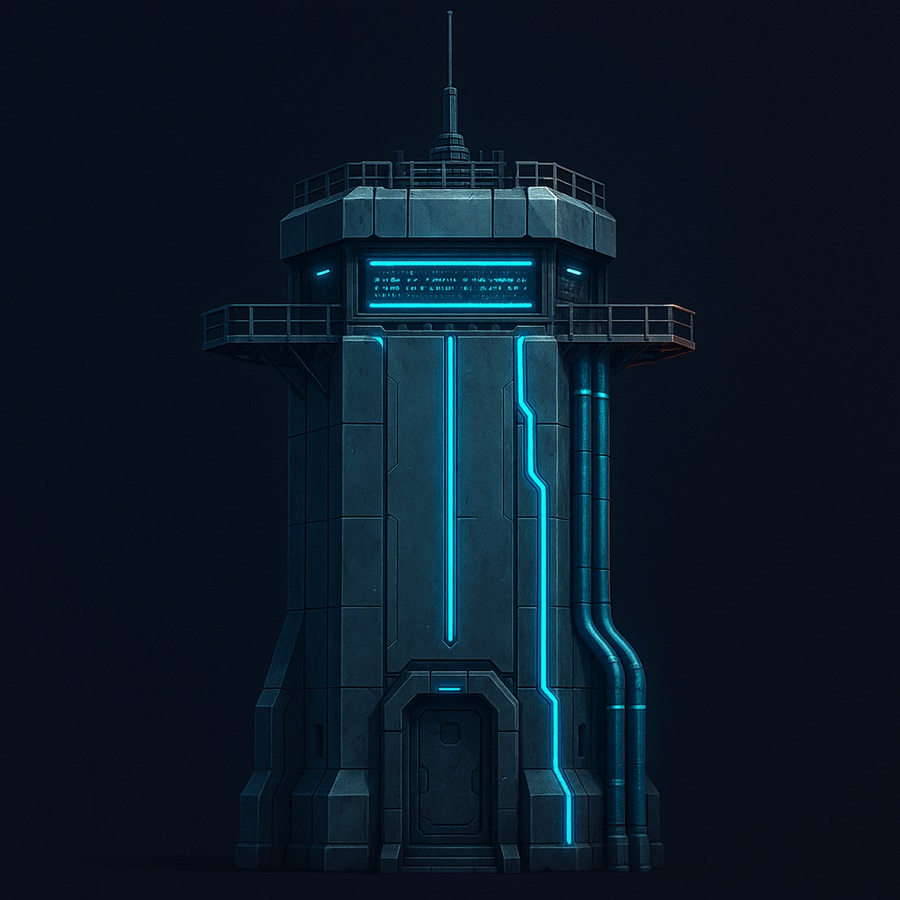
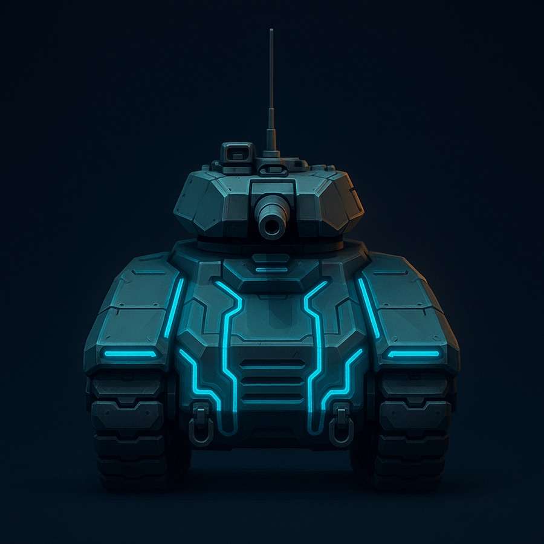
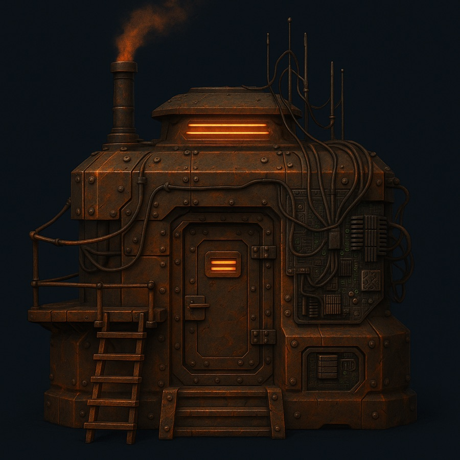
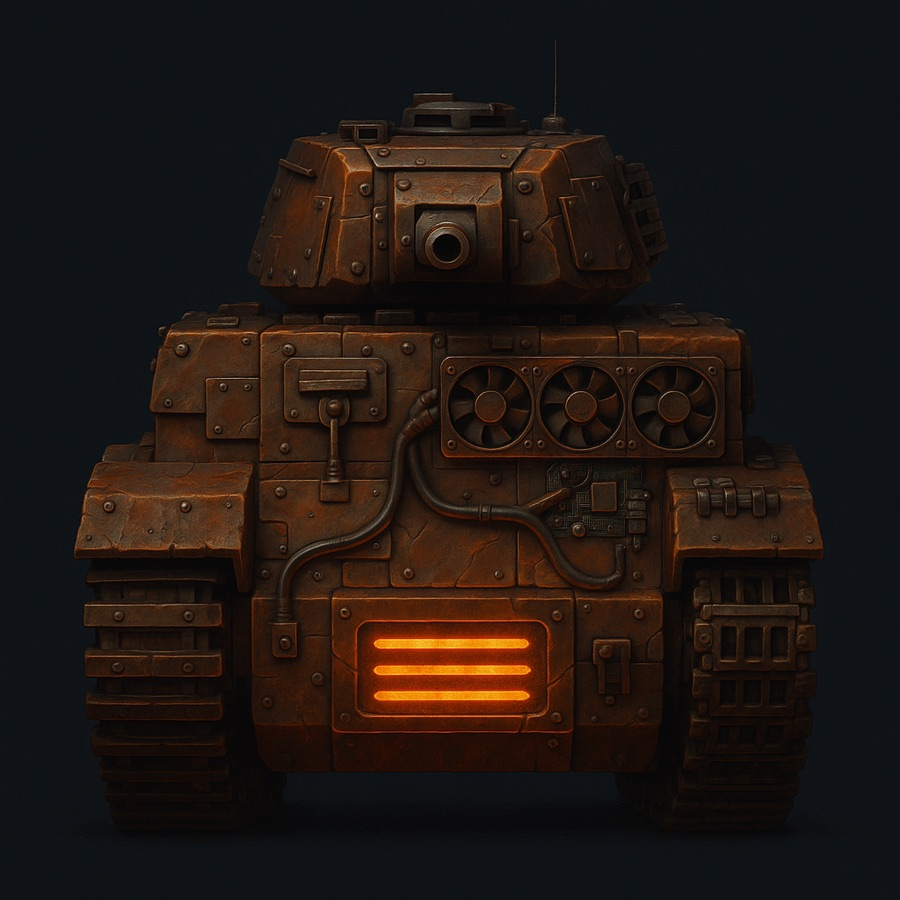
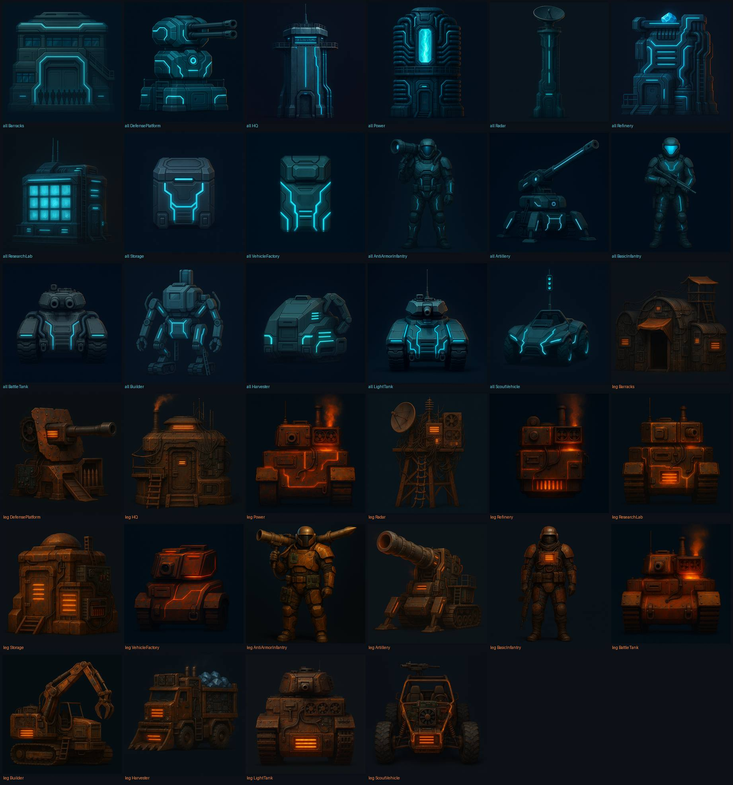

# Project Nova

**Dokumentversion:** 0.15.0 | **Status:** unveröffentlichter Recovery-Stand | **Verantwortungsbereich:** Executive Producer / Technical Writer | **Sprint:** 7

> Ein Echtzeitstrategiespiel in der Tradition von **Command &amp; Conquer** — Basisbau,
> Ernte, Armee, Karte kontrollieren. Gebaut mit Unity und C#, offen entwickelt.
> **Arbeitstitel in Umstellung: _Hashkrieg_.**

| Allianz | | Legion | |
|---|---|---|---|
|  |  |  |  |

<sub>Concept-Art, keine Bildschirmfotos aus dem Spiel. Der komplette Satz: [Kontaktbogen](docs/assets/concept-art/KONTAKTBOGEN.jpg)</sub>

## Zweck

Diese Seite ist der Einstieg in Repository, Projektstatus und Dokumentation.
Sie unterscheidet bewusst zwischen vorhandenem Prototypcode und dem, was
tatsächlich läuft — und sie sagt offen, welche Entscheidung als Nächstes ansteht.

## Abhängigkeiten

- [GOVERNANCE.md](GOVERNANCE.md) – Tier-Modell, aktives Governance-Tier
- [AGENTS.md](AGENTS.md) – verbindliche Arbeitsregeln
- [CONTRIBUTING.md](CONTRIBUTING.md) – Branch-, PR- und Review-Ablauf
- [docs/README.md](docs/README.md) – vollständiger Wiki-Index
- [docs/vision/Lore.md](docs/vision/Lore.md) – Weltentwurf *Hashkrieg*
- [docs/vision/Konzept_Hashkrieg.md](docs/vision/Konzept_Hashkrieg.md) – die
  Mechanik-Variante, über die entschieden werden muss
- [docs/production/MVPRecoveryPlan.md](docs/production/MVPRecoveryPlan.md) –
  Inhalt der Stufen G0 bis G5 (Evidenzvertrag ruht)
- [docs/production/MVPContentManifest.md](docs/production/MVPContentManifest.md) –
  exakter MS-1-Inhalt
- [docs/production/DecisionLog.md](docs/production/DecisionLog.md) – alle
  Entscheidungen mit Alternativen
- [docs/production/ScopeLedger.md](docs/production/ScopeLedger.md) – Register
  aller Verschiebungen gegenüber dem MS-1-Inhalt

## 1. Die Richtung: Hashkrieg

Die Welt ist nicht an einem Krieg zugrunde gegangen, sondern an einer
**Abrechnung**. Als Rechenleistung die einzige Größe wurde, die noch Wert
bemaß, verfiel am Tag des Großen Abschlusses jeder Anspruch, der nicht durch
nachgewiesene Rechenleistung gedeckt war. Renten, Anleihen, Grundbücher. Nicht
gestohlen — nur nicht abgerechnet. Es war eine korrekt ausgeführte Regel, und
genau daran zerbricht die Welt bis heute: **Es gibt niemanden, den man dafür
hängen könnte.**

Beide Fraktionen haben denselben Tag erlebt und entgegengesetzte Lehren gezogen:

| | **Allianz** | **Legion** |
|---|---|---|
| Lehre | *Es war ein Buchhaltungsfehler* | *Genau so fängt es wieder an* |
| Ziel | eine verlässliche Abrechnungsinstanz | die Kette dauerhaft umkämpft halten |
| Baut | für die Ewigkeit: versiegelt, teuer, symmetrisch | für morgen früh: offen, billig, ersetzbar |
| Widerspruch | braucht dafür ein Monopol | braucht dafür den ewigen Krieg |

**Frieden ist nicht Unwille, sondern Arithmetik.** Einkommen ist Anteil, nicht
Ertrag: Wer nicht wächst, schrumpft. Und die 51-Prozent-Mehrheit ist für die
Allianz der Sieg und für die Legion das Weltende — beide haben recht.

Der vollständige Weltentwurf inklusive Kampagnen-Anker steht in
[docs/vision/Lore.md](docs/vision/Lore.md).

## 2. Die offene Entscheidung — hier lohnt sich Mitreden

Das ist gerade die **wichtigste ungeklärte Frage** des Projekts, und sie ist
bewusst offen: Ändern wir die ökonomische Grundschleife, oder nicht?

**Heute (und in jedem RTS seit 1995):** Ressourcen fließen **nach innen**.
Harvester fahren raus, sammeln Aetherium, bringen es heim. Die Basis verbraucht.

**Die Variante „Hashkrieg":** Energie fließt **nach außen**. Du erzeugst Strom
im Zentrum deiner Basis und lieferst ihn per Konvoi an Rechenfarmen an der
Peripherie, die Ertrag erwirtschaften. Jedes Watt ist eine Entscheidung —
**rechnet es, oder schießt es?**

Was daran hängt:

| | bleibt gleich | ändert sich |
|---|---|---|
| Sammler-Loop | Ladung, Ladezeit, Docks, verwundbare Konvois | die **Richtung** kehrt sich um |
| Biome | Karten und Gelände | bekommen eine **wirtschaftliche** Identität (Kühlung) |
| Wirtschaftsknick | Taktgeber ins Endgame | wird zum angekündigten **Halving** |
| Superwaffe | teuer, sichtbar, sabotierbar | wird zur **51-Prozent-Attacke** |
| Fog of War | gilt für die Karte | gilt **nicht** für die Konten: jeder sieht die Einnahmen aller |

Die vollständige Analyse mit Mechanik-Mapping, Match-Bogen und drei bewerteten
Optionen steht in
[docs/vision/Konzept_Hashkrieg.md](docs/vision/Konzept_Hashkrieg.md).
Kurzfassung der dortigen Empfehlung: **MS-1 wie geplant fertigstellen** — die
Mechanik ist mechanisch fast identisch und validiert sich dabei selbst —, den
Hashkrieg-Umbau **danach** als Prototyp erproben.

Gegenmeinungen sind ausdrücklich erwünscht. Wenn du dazu etwas zu sagen hast:
[ein Issue aufmachen](https://github.com/VibecodingGermany/Project_Nova/issues/new)
und in zwei Sätzen begründen, welche Option du für richtig hältst.

## 3. Projektstatus

**Phase:** Implementierungs-Recovery · **Aktiv:** Sprint 7 · **Governance:** Tier 1

| Ergebnisstufe | Status |
|---|---|
| Sprint 7 | läuft |
| Spielbar | lokales 1v1 auf der Glutrinne-Graybox (siehe §4) |
| MS-0 | offen — Kern läuft, Cross-Plattform- und Perf-Nachweise stehen aus |
| MS-1 / MVP | nicht erreicht — Lücken im [ScopeLedger](docs/production/ScopeLedger.md) |
| Alpha | nicht begonnen |

Was zuletzt entstanden ist:

- **Graybox-Slice** — die Simulation ist erstmals sicht- und bedienbar (siehe §4)
- **Fraktionsidentität** — Allianz und Legion spielen sich unterschiedlich:
  Schadensmatrix, Waffenwerte, Siegbedingungen, fraktionsaufgelöste
  Definitionstabelle und Harvester-Kapazität
- **Weltentwurf und Concept-Art** — 34 Bilder, ein Bildstandard, eine Lore (§5)

Das Repository enthält einen unvollständig integrierten Prototyp. Dateien,
Typen und isolierte Tests sind kein Fertignachweis — führend bleibt der
[Implementierungs-Audit](docs/production/ImplementationAudit_2026-07-24.md).
Was stattdessen als Nachweis zählt, definiert [GOVERNANCE.md](GOVERNANCE.md):
**grüne CI plus eine gespielte und protokollierte Runde.**

Seit D-076 gilt **Governance-Tier 1** (zwei Entwickler, kein Publikum). Das
Gate-Regime G0–G5 mit Evidence- und Receipt-Verträgen blockiert nichts mehr; es
ist vollständig erhalten und ruht bis Tier 3 — siehe
[quality/README.md](quality/README.md).

## 4. Das Spiel ausprobieren (Graybox)

Seit dem Graybox-Slice ist das Spiel **sicht- und bedienbar**: lokales 1v1 mit
Wirtschaft, Bau, Produktion, Fog of War, Schadensmatrix und Siegauswertung. Was
es zeigt und was noch fehlt, steht weiter unten — bitte vor dem ersten Start
lesen.

### Variante 1: im Editor (empfohlen)

1. Projekt in **Unity `6000.5.4f1`** öffnen (exakter Pin, kein Auto-Upgrade).
2. `Assets/_Project/Scenes/Bootstrap.unity` öffnen und **Play** drücken.
3. Das Match startet von selbst: 128×128-Karte, zwei Slots, du bist Slot 0.

Die Szene ist **Maschinenausgabe**. Wenn sie beschädigt oder veraltet ist, wird
sie über das Menü `Tools/Project Nova/Create Bootstrap Scene` neu erzeugt — die
`.unity`-Datei wird nie von Hand bearbeitet.

### Steuerung

Verbindlich ist der Code (`RtsDeviceInput`); das HUD zeigt dieselbe Legende an.

| Eingabe | Wirkung |
|---|---|
| Linke Maustaste, Klick | Eigene Einheit unter dem Cursor auswählen, sonst Auswahl leeren |
| Linke Maustaste, Ziehen | Box-Auswahl eigener Einheiten |
| Rechte Maustaste | Bewegen zum Zielpunkt |
| `S` | Stop |
| `A` | Angriff: Gegner unter dem Cursor wird echtes Angriffsziel, sonst Bewegung dorthin |
| `H` | Nächstes nicht erschöpftes Aetherium-Feld ernten |
| `R` | Ladung zur Raffinerie zurückbringen |
| `B` / `Shift`+`B` | Gebäude platzieren: Kraftwerk / Kaserne |
| `Q` / `Shift`+`Q` | Einheit in Auftrag geben: Harvester (HQ) / Infanterie (Kaserne) |
| Pfeiltasten, Bildschirmrand | Kamera schwenken |
| Mausrad | Zoom |
| `Z` / `X` | Kamera drehen |

Es gibt **keine Pause-Taste**, kein Speichern und kein Laden in dieser
Bedienschicht.

### Variante 2: fertige Player

Beide Player entstehen im Verzeichnis `Builds/`, das **gitignoriert** ist. Sie
liegen also nur auf der Maschine, die sie gebaut hat. Neu bauen im Batchmode:

```bash
/Applications/Unity/Hub/Editor/6000.5.4f1/Unity.app/Contents/MacOS/Unity \
  -quit -batchmode -nographics -projectPath "$PWD" \
  -executeMethod Nova.Editor.BuildScript.BuildMacOSArm64   # oder BuildWindows64
```

**macOS** — `Builds/MacOSArm64/ProjectNova.app` ist ein **unsigniertes, lokales
Artefakt** ohne Notarisierung; Gatekeeper blockiert den ersten Start:

```bash
xattr -dr com.apple.quarantine "Builds/MacOSArm64/ProjectNova.app"
open "Builds/MacOSArm64/ProjectNova.app"
```

**Windows** — `Builds/Windows64/ProjectNova.exe` ist ein unsignierter
Mono-Player, **von macOS aus gebaut**. SmartScreen warnt beim ersten Start.
Ehrliche Einschränkung: Der Build ist abgeschlossen, wurde aber **nie
ausgeführt** — der erste Windows-Start ist gleichzeitig der erste echte Test.

### Was die Graybox zeigt — und was nicht

**Zu sehen und zu prüfen:** Lockstep-Kern mit 10 Hz, Befehle ausschließlich
durch den versiegelten Command-Pfad; Auswahl, Bewegung, Flow-Field-Pathfinding,
Bau, Produktion; Fog of War; Ökonomie-Grundlagen im Debug-HUD; Form kodiert
Rolle, Farbe kodiert Spieler.

**Ausdrücklich nicht beurteilbar:**

- **Der Gegner spielt nicht.** Slot 1 bekommt eine Startbasis und sonst nichts;
  es gibt noch keine KI.
- **Der Harvester-Kreislauf schließt sich nicht** von allein. Manuell (`H`,
  dann `R`, dann fahren) funktioniert der Zyklus.
- **Das HUD ist eine Debug-Überlagerung**, keine UI. Keine Pause, kein
  Save/Load, kein Rebinding.
- **Look and Feel ist unverifiziert.** Ob die Graybox lesbar ist und sich die
  Steuerung richtig anfühlt, konnte automatisiert niemand prüfen — das ist
  genau die Frage, die der erste menschliche Durchlauf beantwortet.

Die vollständige Liste der Verschiebungen steht im
[ScopeLedger](docs/production/ScopeLedger.md), das Sitzungsprotokoll im
[GrayboxLog](docs/production/GrayboxLog.md).

## 5. Concept-Art

[](docs/assets/concept-art/KONTAKTBOGEN.jpg)

34 Entwürfe, 17 Rollen je Fraktion, alle im selben Format und derselben
Lichtsetzung. Der Leuchtakzent trägt die Fraktionsidentität — Cyan gegen
Orange — und entspricht der Teamfarben-Maske im späteren Spielasset.

- [Bildstandard](docs/assets/ConceptArtStyleGuide.md) – Rahmung, Licht, Palette,
  Formensprache, Maßstabsanker, Abnahmekriterien
- [Ordner und Herkunftsnachweis](docs/assets/concept-art/README.md) – Provenienz
  je Bild inklusive Modell, Prompt und SHA-256

**Status:** Entwürfe zur Formfindung, **keine Produktionsassets**. Es existiert
kein 3D-Asset im Projekt.

## 6. Mitmachen

Das Projekt ist offen und wird gerade von sehr wenigen Leuten getragen.
Mithilfe ist willkommen — besonders in diesen Bereichen:

| Du kannst… | Dann schau hier |
|---|---|
| **mitentscheiden**, ob die Wirtschaft umgedreht wird | §2 und [Konzept_Hashkrieg.md](docs/vision/Konzept_Hashkrieg.md) |
| **die Graybox spielen** und sagen, wie sie sich anfühlt | §4 — Look and Feel ist bisher von niemandem beurteilt |
| **3D-Assets bauen** aus den Concept-Art-Vorlagen | [Bildstandard](docs/assets/ConceptArtStyleGuide.md) und [AssetBudget](docs/tech/AssetBudget.md) |
| **an der Simulation arbeiten** (C#, deterministisch, Unity-frei) | [SimulationCore](docs/tech/SimulationCore.md) und [CodingGuidelines](docs/tech/CodingGuidelines.md) |
| **KI schreiben** — Slot 1 spielt bisher gar nicht | [SkirmishAi_Spec](docs/tech/modules/SkirmishAi_Spec.md) |
| **Doku verbessern** | [DocumentationStandard](docs/meta/DocumentationStandard.md) |

Zwei Dinge, die den Einstieg leichter machen: Der Simulationskern ist
**Unity-frei** und läuft headless über `tools/Nova.SimRunner` — man braucht
Unity nur für die Darstellung. Und jede Entscheidung im Projekt steht mit
mindestens drei geprüften Alternativen im
[DecisionLog](docs/production/DecisionLog.md); nichts wird still geändert.

Ablauf steht in [CONTRIBUTING.md](CONTRIBUTING.md). Fragen gern als
[Issue](https://github.com/VibecodingGermany/Project_Nova/issues).

## 7. Closed-Core MS-1

D-056 begrenzt MS-1 auf:

- Allianz gegen Legion, Mensch gegen KI;
- Glutrinne, Wüste, S, 128×128, klares Wetter;
- je neun Gebäude- und acht Einheitenrollen;
- vollständiges Aetherium einschließlich endlicher Reserve, Nachwachsen,
  Ausbreitung, permanenter Überernte und KI-Feldmanagement;
- Pause, Save/Load/Recovery und das definierte Accessibility-Minimum.

Evolvierte, Luft, T3, Zusatzkarten, Multiplayer, Kampagne, Telemetrie,
Steam/Cloud und finale Art/Audio sind Post-MVP.

## 8. Tech-Stack

- **Engine:** Unity `6000.5.4f1`, Revision `d550df8bd089`
- **Rendering:** URP
- **Sprache:** C#
- **Simulation:** Unity-freier, autoritativer `Nova.Simulation`-Kern,
  Q16.16-Fixed-Point ab G1
- **Host:** Unity und `Nova.SimRunner` verwenden dieselben Core-/Sim-Quellen

Automatische Editor-Upgrades sind verboten. Eine Re-Evaluierung benötigt nach
G5 oder bei einem belegten Engine-Blocker eine neue D-ID.

## 9. Repository-Struktur

```text
Project Nova/
├── Assets/                Unity-Projekt und Prototypcode
├── docs/                  Living-Documents-Wiki
│   ├── vision/            Weltentwurf, Kernspielgefühl, Zielgruppe
│   ├── gamedesign/        Vollspiel-GDD mit MS-1-Overrides
│   ├── tech/              technische Verträge
│   ├── assets/            Art-Standard und Concept-Art
│   └── production/        Entscheidungen, Gates, Risiken, Planung
├── quality/
│   ├── content/           maschinenlesbares MVP-Manifest
│   ├── scenarios/         kanonische Abnahmeszenarien
│   ├── schemas/           Evidence-Schema; keine Platzhalter-Evidence
│   └── scripts/           Schema-, Semantik- und Integritätsprüfung
├── tools/                 unter anderem Nova.SimRunner
├── AGENTS.md
├── CONTRIBUTING.md
└── CHANGELOG.md
```

## 10. Arbeitsweise

`main` ist PR-only. Arbeit erfolgt auf kurzen
`feat/`, `fix/`, `docs/`, `chore/`, `refactor/` oder `codex/`-Branches,
gefolgt von Squash-Merge und linearer Historie. Es gibt keinen dauerhaften
Integrationsbranch.

Pflichtchecks sind `docs-check` und für Quality-Verträge `integrity`. Dieser
Teil des `quality-gate` prüft nur Verträge und Negative Controls. Ein
Authorize-Job existiert bis G0-A2 bewusst nicht. Eine Änderung am Trust-Bundle
wird ohne Gate-Fortschritt gemergt und kann sich nicht selbst autorisieren.

## 11. Lizenz

© 2026 VibecodingGermany / Dennis Westermann. **Alle Rechte vorbehalten.**

Es liegt derzeit **keine Open-Source-Lizenz** vor. Ansehen, Ausprobieren und
Mitwirken per Pull Request sind ausdrücklich erwünscht; eine Weiterverbreitung
als eigenes Werk ist nicht freigegeben. Wer beitragen möchte, kann das tun —
die Lizenzfrage wird vor einer Veröffentlichung geklärt und ist als offener
Punkt geführt.

## Offene Punkte

- **Die Wirtschaftsfrage aus §2** ist die wichtigste offene Entscheidung.
- Eine formale Lizenz ist noch festzulegen. Sie entscheidet, unter welchen
  Bedingungen Beiträge Dritter angenommen werden können.
- Der Umbenennungsbeschluss auf *Hashkrieg* ist im Bestand dieses Repositories
  noch nicht vollzogen — Repo, Code und Wiki laufen weiter unter *Project Nova*.
- Q-018 (Preis) und Q-019 (Telemetrie) bleiben offen und blockieren MS-1 nicht.

## Nächste Schritte

1. G0-A1 ohne Gate-Fortschritt geschützt mergen.
2. G0-A2 als separaten zweiphasigen Receipt-Authorizer implementieren und
   adversarial prüfen.
3. Am nachfolgenden sauberen Subject G0-B herstellen und dort mit der
   vollständigen Receipt-Kette und Umgebungsbindung G0 beweisen.
4. G1 einschließlich V1–V5a erst nach bestandenem G0 beginnen.

## Änderungsverlauf

| Version | Datum | Änderung | Autor |
|---|---|---|---|
| 0.7.1 | 2026-07-24 | Recovery-Baseline nach Implementierungs-Audit | Executive Producer / Lead Technical Director |
| 0.8.0 | 2026-07-24 | Closed-Core MS-1, exakten Engine-Pin, G0-offenen Status und Quality-Verträge D-056–D-061 aufgenommen | Executive Producer / Technical Writer |
| 0.8.1 | 2026-07-24 | Evidence-Semantikvalidator ergänzt und Dokumentstruktur korrigiert | Technical Writer / Lead QA Engineer |
| 0.8.2 | 2026-07-24 | Sprint-6-Endstatus und auf G0 begrenzten Start von Sprint 7 eindeutig formuliert | Executive Producer / Technical Writer |
| 0.9.0 | 2026-07-24 | D-062-Evidence-Kette sowie Victory-, MatchConfig- und Commander-MS-1-Overrides ergänzt | Executive Producer / Technical Writer / Lead QA Engineer |
| 0.10.0 | 2026-07-24 | D-063-Schema 1.2, kanonische Check-Artefakte, Drei-Lauf-Messung und Protected-CI-Trustpfad aufgenommen | Executive Producer / Technical Writer / Lead QA Engineer |
| 0.11.0 | 2026-07-24 | D-064: Schema 1.2 auf Integrität begrenzt, G0-A vor G0-B gestellt und subject-unabhängigen Schema-1.3-Bootstrap verankert | Executive Producer / Technical Writer / Lead QA Engineer |
| 0.12.0 | 2026-07-25 | D-066: G0-A1-Integritätsgrundlage vom zweiphasigen G0-A2-Receipt-Authorizer getrennt und zirkulären Pass-Pfad entfernt | Executive Producer / Technical Writer / Lead QA Engineer |
| 0.13.0 | 2026-07-26 | Abschnitt „Das Spiel ausprobieren" mit Editor-Start, Steuerungslegende, Player-Anleitung und ehrlicher Abgrenzung des Graybox-Stands ergänzt | Technical Writer |
| 0.14.0 | 2026-07-26 | Abschnitt zum neuen Arbeitstitel *Hashkrieg* ergänzt: Weltentwurf, Concept-Art-Satz und Style-Guide verlinkt | Technical Writer |
| 0.15.0 | 2026-07-26 | Neu gegliedert und bebildert: Hashkrieg-Richtung nach vorn gezogen, die offene Wirtschaftsentscheidung als eigener Abschnitt sichtbar gemacht, Mitmach-Abschnitt mit Einstiegspunkten ergänzt, Projektstatus um Graybox und Fraktionsidentität aktualisiert, Lizenzlage präzisiert | Technical Writer |
